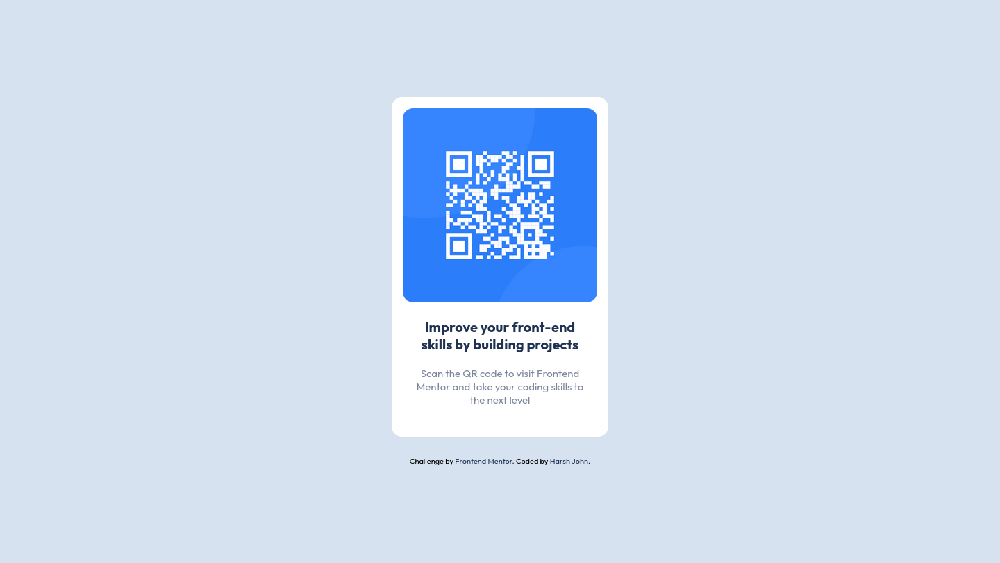
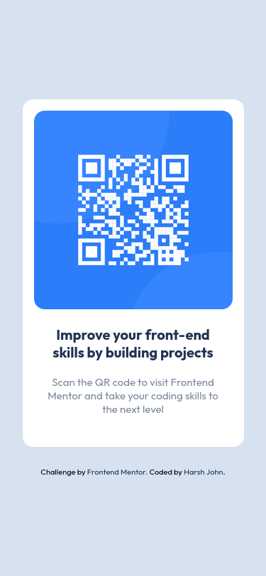

# Frontend Mentor - QR code component solution

This is a solution to the [QR code component challenge on Frontend Mentor](https://www.frontendmentor.io/challenges/qr-code-component-iux_sIO_H). Frontend Mentor challenges help you improve your coding skills by building realistic projects. 

## Table of contents

- [Overview](#overview)
  - [Screenshot](#screenshot)
  - [Links](#links)
- [My process](#my-process)
  - [Built with](#built-with)
  - [What I learned](#what-i-learned)
  - [Continued development](#continued-development)
  - [Useful resources](#useful-resources)
- [Author](#author)
- [Acknowledgments](#acknowledgments)

**Note: Delete this note and update the table of contents based on what sections you keep.**

## Overview

### Screenshot

#Screenshot when width=1440px


#screenshot when width=375px


### Links

- Solution URL: [GitHub Repo](https://github.com/HarshJohn/qr-code-component-main.git)
- Live Site URL: [QR-Code-component-website](https://qr-code-frontendmentor-challenge-harshjohn.netlify.app/)

## My process

### Built with

- Semantic HTML5 markup
- CSS custom properties
- Flexbox
- Mobile-first workflow

### What I learned

I was able to utilize custom css properties that I learned in my previous project in this project.
I was able to use flexbox to center the element where margin was not working.
I was able to make website responsive, even though there was not so much work.

I learned something about git and github along with the project which is most important lesson from this simple challenge.

To see how you can add code snippets, see below:

```html
<h1>Some HTML code I'm proud of</h1>
```
```css
:root {
    --ff: 'Outfit', sans-serif;

    --fs-reg: 400;
    --fs-bold: 700;

    --bg-clr-light: hsl(0, 0%, 100%);
    --bg-clr-gray: hsl(212, 45%, 89%);
    --bg-clr-grayish-blue: hsl(220, 15%, 55%);
    --bg-clr-dark-blue: hsl(218, 44%, 22%);

    --fs-h1: 1.25rem;
    --fs-body: 15px;

    --ws-mobile: 375px;
    --ws-desktop: 1440px;
}

```
### Continued development

The responsiveness of a website is one of the most important feature. I think I am getting a hang of this feature.

I'll continue to work and improve along with some complicated challenges.

## Author

- Website - [Harsh John](https://harshjohn.github.io/)
- Frontend Mentor - [@HarshJohn](https://www.frontendmentor.io/profile/HarshJohn)
- Twitter - [@harshj_ohn](https://twitter.com/harshj_ohn)

## Acknowledgments

The credit to whatever I know goes to many teachers online.
Most imp is freecodecamp.org
YouTube is another place where people are helping people like me to learn and stay motivated.
I want to thank frontEndMentor too for providing a set of challenges that I am gonna finish eventually. It will help me improve my skills and ultimately make some money out of it.
